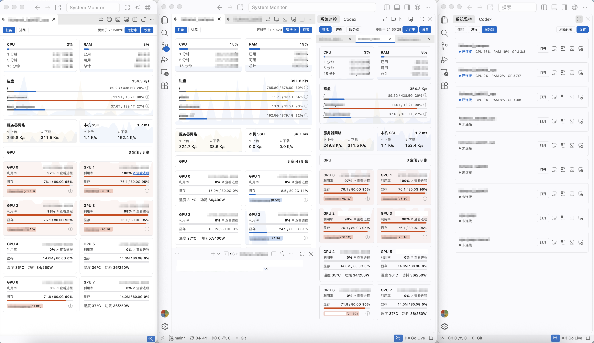
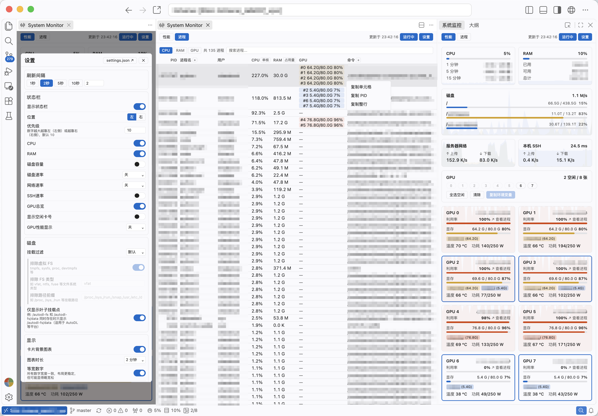

# System Monitor

[](https://marketplace.visualstudio.com/items?itemName=LiChenxi.sysmonitor)
[](https://marketplace.visualstudio.com/items?itemName=LiChenxi.sysmonitor)
[](https://marketplace.visualstudio.com/items?itemName=LiChenxi.sysmonitor)
[](https://open-vsx.org/extension/LiChenxi/sysmonitor)
[](https://open-vsx.org/extension/LiChenxi/sysmonitor)
[](https://github.com/lcx-0504/sysmonitor)
[](LICENSE)

[中文说明](README.zh-CN.md)

Monitor Linux servers from VS Code or Cursor: check resource usage, find busy processes, and see which GPUs are available. View several servers side by side without leaving your editor.

Use it on a Linux machine, from a local macOS or Windows window over SSH, or inside a Remote-SSH, WSL, or Dev Container window.

Monitor multiple servers over SSH from a local window, with views in the sidebar, editor, or separate windows.



Monitor the connected machine inside a Remote-SSH window.



The screenshots show the Chinese UI. The extension follows your VS Code display language.

## Get started

Install **System Monitor** from [VS Marketplace](https://marketplace.visualstudio.com/items?itemName=LiChenxi.sysmonitor) or [Open VSX](https://open-vsx.org/extension/LiChenxi/sysmonitor), then open the **System Monitor** view.

| Your environment | How to use it |
|---|---|
| Local Linux | View the local machine immediately. Use **Servers** to open other Linux hosts from your SSH config. |
| Local macOS or Windows | Choose a Linux host from **Servers**. Monitoring your local macOS or Windows machine is not supported. |
| Remote-SSH, WSL, or Dev Container on Linux | Install or enable the extension in that remote environment to monitor the machine where it runs. |

### Connect from a local window

The server list reads host aliases from your SSH config. It uses `remote.SSH.configFile` when configured, otherwise `~/.ssh/config` (or `%USERPROFILE%\.ssh\config` on Windows), and supports included config files.

Background monitoring needs a working system `ssh` client and a connection that does not require an interactive password, key-passphrase, or verification-code prompt. SSH keys, an SSH agent, or an already authenticated reusable SSH connection can provide this. To check, replace `your-server` with your host alias and run:

```sh
ssh -T -o BatchMode=yes your-server true
```

If it completes successfully without asking for input, choose that host in **Servers** and click **Open**. The SSH terminal shortcut remains available for interactive logins.

To install System Monitor automatically in future Remote-SSH windows, click **Add to defaults** in **Settings → Servers**. Remote-SSH will install the published Marketplace version.

## Features

### Check resources and recent trends

The **Performance** page shows CPU usage and load, memory, disk capacity and I/O, network rates, and GPU metrics. Background charts help you spot changes over time. Hide the groups you do not need or turn off charts in Settings.

Hover over a disk's information icon for its used, reserved, and available space. Disk filters let you focus on the mounts that matter to you, including network storage.

### Find resource-heavy processes

The **Processes** page sorts by CPU, memory, or GPU usage. Search by process name, PID, user, or command; use `GPU0` or `#0` to focus on a particular card. The table shows up to 100 matching results.

Expand the command column to inspect how a process was launched, and right-click to copy a PID, cell, or row. CPU usage can be shown relative to a single core or the whole machine; memory can be shown as capacity or a percentage.

### See GPU availability and usage

For NVIDIA GPUs, view utilization, VRAM, temperature, power, and the users occupying memory. Highlight the cards used by your own processes, or choose idle cards and copy a `CUDA_VISIBLE_DEVICES` setting for your next command.

GPU monitoring requires `nvidia-smi` on the monitored machine. Other system metrics remain available on machines without NVIDIA GPUs.

### Multiple servers and windows

Keep server tabs in the sidebar, open individual monitors in Editor tabs, or put them in separate windows. Title-bar buttons let you move existing views between these locations. Multiple views of one server share the same monitoring data.

The **SSH terminal** shortcut opens a command-line session. **Open Remote Window** uses VS Code's Remote-SSH extension to open a development workspace. In **Settings → Action Buttons**, choose whether that button opens a new workspace, the first recent workspace, or a selection menu. With no recent history, it opens a new remote window without a folder.

On local or remote Linux, the status bar can keep selected metrics visible while you work. It always represents the Linux machine running the extension; local macOS and Windows windows have no System Monitor status bar.

## Settings

Open **Settings** in the monitoring view. Changes are saved to VS Code User settings and apply immediately.

| Setting | When it is useful |
|---|---|
| Refresh interval | The default is 2 seconds. Increase it when a server is busy or the connection is slow. |
| Display and charts | Choose visible sections, chart history length, and GPU user labels. |
| Status bar | Pick the metrics to keep visible, including specific GPUs or only those used by your processes. |
| Disk filters | Show additional mounts or exclude filesystems and paths you do not need. |
| Action buttons | Hide unused shortcuts and choose the remote-window button's behavior. |
| Servers | Restore your tabs on startup, or enable **Refresh visible panels only** to reduce background collection. |

Open server tabs continue collecting in the background by default. Visible-only collection reduces that work, but switching back may take longer to show fresh data. Sidebar device tabs are remembered per workspace.

Click **Running / Paused** to pause or resume all monitoring in the current VS Code window. **Retry** while paused performs one update and leaves monitoring paused.

## Questions and troubleshooting

### A server is missing or will not connect

Check the SSH config selected by VS Code, then refresh the Servers list. Entries need explicit `Host` aliases; wildcard patterns are not listed as individual servers.

Test authentication with the non-interactive SSH command shown above. For a passphrase-protected private key, load the key into an SSH agent first. If the server requires TOTP or another interactive authentication step, complete it in a terminal or through an existing trusted authentication script and establish a reusable SSH master connection.

If the local SSH client supports and is configured for [connection multiplexing](https://man.openbsd.org/ssh_config#ControlMaster), using options such as `ControlMaster`, `ControlPath`, and `ControlPersist`, the extension can reuse the authenticated connection. Run the test command again to confirm. Authentication is needed again when the master connection closes or expires.

If connection multiplexing is unavailable or non-interactive access still fails, use **Open Remote Window** to sign in through Remote-SSH, then install or enable System Monitor in that remote window to monitor the server directly.

### GPU or SSH information is unavailable

Check that `nvidia-smi` works on the monitored machine for NVIDIA metrics. SSH traffic and latency require the Linux `ss` command and accessible TCP statistics. Missing optional metrics do not prevent other sections from working.

With SSH connection multiplexing, traffic figures can include other sessions sharing the same TCP connection.

### Disk usage looks different from “used space”

The disk bar includes space unavailable to ordinary users, such as filesystem reserves. Hover over the information icon to see the breakdown. Mounts without usable capacity information are omitted.

### Collection times out or monitoring pauses automatically

Check the network and server load, and try a longer refresh interval. Existing views keep their last available data when collection fails.

When several collection processes are confirmed to remain after interrupted SSH requests, the extension pauses monitoring and displays their PIDs for inspection. Dismissing the notice does not resume monitoring; resume it manually after checking the server.

Local SSH collection uses the system's SSH configuration. It does not install a monitoring service, require Python, or create monitoring temporary files on the server. It also does not automatically clean up remote processes; an interrupted command may continue until it finishes.

## Feedback

For bugs or feature requests, open a [GitHub issue](https://github.com/lcx-0504/sysmonitor/issues). For connection problems, include the relevant error, your local and remote operating systems, and whether you use local SSH monitoring or a remote window. Remove passwords, tokens, and other private information from logs before sharing them.

See the [changelog](CHANGELOG.md) for release notes.

## Contributors

<a href="https://github.com/lcx-0504" title="Author"></a>
<a href="https://github.com/klay7w" title="Helped fix GPU refresh stability"></a>

## License

[MIT](LICENSE)
